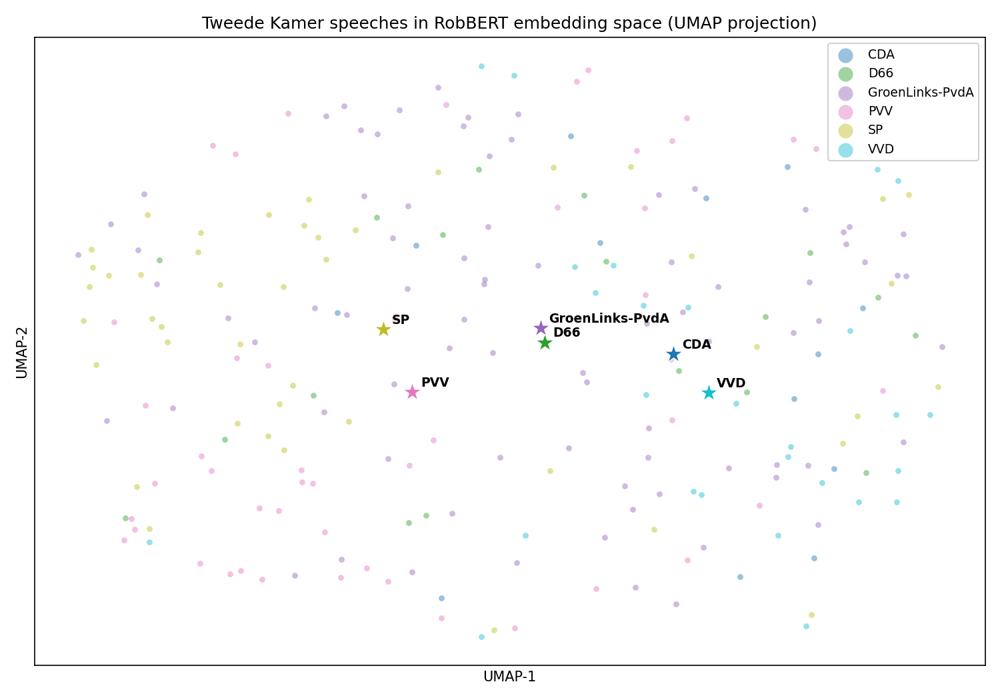
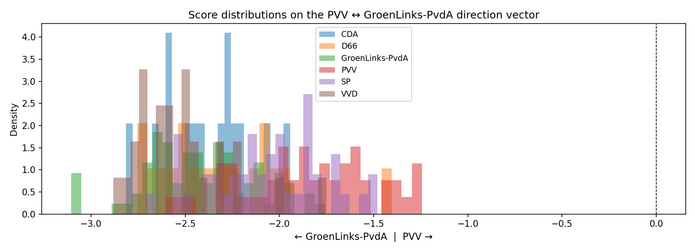

# Ideology embeddings — probing Dutch parliamentary speech with RobBERT

A proof of concept. Can you recover **ideology direction vectors** from a Dutch
BERT's embedding space, using Tweede Kamer speeches as labelled data, and then
project unseen text onto those axes?

Partly. Parties do separate geometrically, the axes are reproducible, and the
projections behave sensibly on obvious test sentences. But a good part of what
the vectors encode turns out to be debate procedure and speaker identity rather
than ideology, so this is a probe of what is recoverable, not a measurement of
where any party stands. The [Limitations](#limitations) section is the
interesting part.



## Method

| Phase | What happens |
|-------|--------------|
| 1A | Fetch plenary speeches from the [Tweede Kamer open data API](https://opendata.tweedekamer.nl/) (`Fractie` → `FractieZetel` → `Spreekbeurt`), parse the Verslag XML |
| 1B | Embed each speech with [RobBERT 2023](https://huggingface.co/DTAI-KULeuven/robbert-2023-dutch-base), mean-pooling the last hidden state over non-padding tokens |
| 1C | PCA to 50 dims (77.4% variance retained), then UMAP to 2D — do parties cluster? |
| 2A | Direction vector per party pair: `mean(A) − mean(B)`, normalised |
| 2B | Project TF-IDF vocabulary onto each axis to see what it actually encodes |
| 3 | Embed arbitrary Dutch text, project onto the axes, report a z-score per axis |

The direction-vector step is the crude version of the approach in Zou et al.,
[*Representation Engineering*](https://arxiv.org/abs/2310.01405) (2023). They
use the first PCA component of within-class covariance, which is more robust
than a raw mean difference. Swapping that in is the obvious next step.

## Results

Party centroids land where you would expect on a left/right reading, and the
1D score distributions for opposed pairs separate cleanly:



Scoring unseen text on three axes at once:

```
Text: 'De elite in Den Haag luistert niet naar gewone Nederlanders. Genoeg is genoeg.'

  PVV        ↔ D66         z=+1.99  → PVV
  SP         ↔ VVD         z=+0.41  → SP
  CDA        ↔ D66         z=+0.84  → CDA
```

## Limitations

These are real and they matter more than the results above.

1. **The axes encode procedure, not only ideology.** The vocabulary most loaded
   on the "GroenLinks-PvdA" end of the PVV↔GL axis includes `commissiedebat`,
   `plenair`, `namens`, `brief`, `motie`. That is debate-genre vocabulary. The
   vector is partly separating *what kind of parliamentary moment this was* from
   *who was speaking*.
2. **Speaker identity leaks in.** `jimmy` and `dijk` load on the SP end of the
   SP↔VVD axis. That is the SP party leader's name, not an ideological signal.
3. **Retrieval is noisy.** The 20 speeches scoring most "GroenLinks-PvdA-like"
   include 7 VVD speeches. A clean axis would not do that.
4. **The compass mislabels at least one obvious case.** "Wij staan voor een open
   samenleving, een sterk Europa en gelijke kansen voor iedereen" scores +0.58
   toward PVV on the PVV↔D66 axis. It should score the other way.
5. **Small, recent, unbalanced sample.** 563 speeches from roughly 30 recent
   plenary sessions, unevenly distributed across 17 parties (93 GroenLinks-PvdA
   vs 1 for 50PLUS). Centroids are only computed for the six best-represented
   parties.
6. **Mean-pooled sentence embeddings are a blunt instrument** for this. Layer
   choice is unexplored — political content may be more concentrated in
   intermediate layers than in the last one.

Treat the output as a demonstration of the technique, not as a measurement of
any party's position.

## Run it

```bash
python -m venv .venv && source .venv/bin/activate
pip install -r requirements.txt
jupyter lab ideology_embeddings.ipynb
```

Run the cells in order. Phase 1A hits the Tweede Kamer API and caches to
`speeches.csv`; that file is committed, so you can skip straight to Phase 1B.
Embedding 563 speeches takes a few minutes on CPU and is cached to
`embeddings.npy` (gitignored, regenerated on first run).

## Data

`speeches.csv` holds 563 speech excerpts labelled by party, pulled from the
Tweede Kamer's public open data API. These are published proceedings of a
national parliament: public record by design, spoken on the floor, already
attributed to named members. No private or scraped personal data is involved.

## Next steps

- Proper repE direction vectors (within-class covariance PCA) instead of mean difference
- Regress out the procedural/genre component before computing axes
- Held-out party validation: does ChristenUnie project sensibly without being in the fit?
- Historical drift: 2015–2017 speeches vs 2022–2024, same axes
- Calibrate against [Kieskompas](https://www.kieskompas.nl/) positions using party manifestos

## AI assistance

Built with AI assistance (Claude). The research question, the choice of method
and the reading of the results are mine; Claude contributed code, plots and
documentation drafting. Every number and quoted output in this README comes
from the notebook in this repo, so you can check them by running it.

## Credits

- [RobBERT 2023](https://huggingface.co/DTAI-KULeuven/robbert-2023-dutch-base) — DTAI, KU Leuven
- [Representation Engineering](https://arxiv.org/abs/2310.01405) — Zou et al., 2023
- [Tweede Kamer Open Data](https://opendata.tweedekamer.nl/)

## Licence

Not yet chosen, so default copyright applies: all rights reserved. Open an issue
if you want to reuse any of it.
